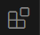
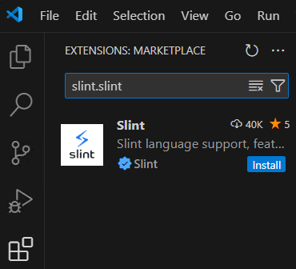
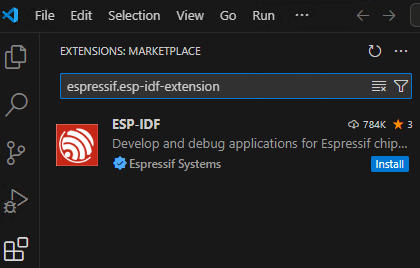
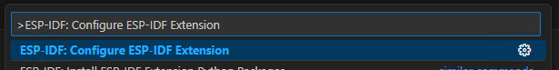
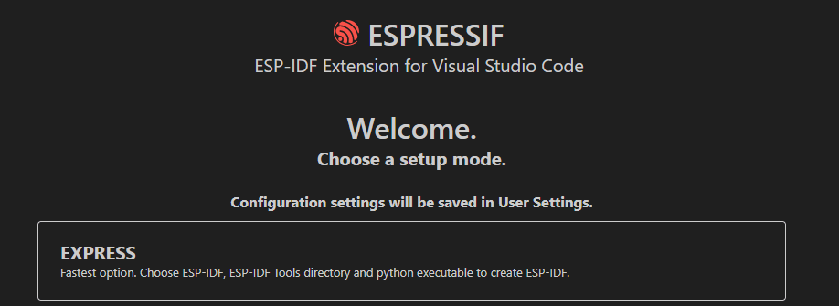
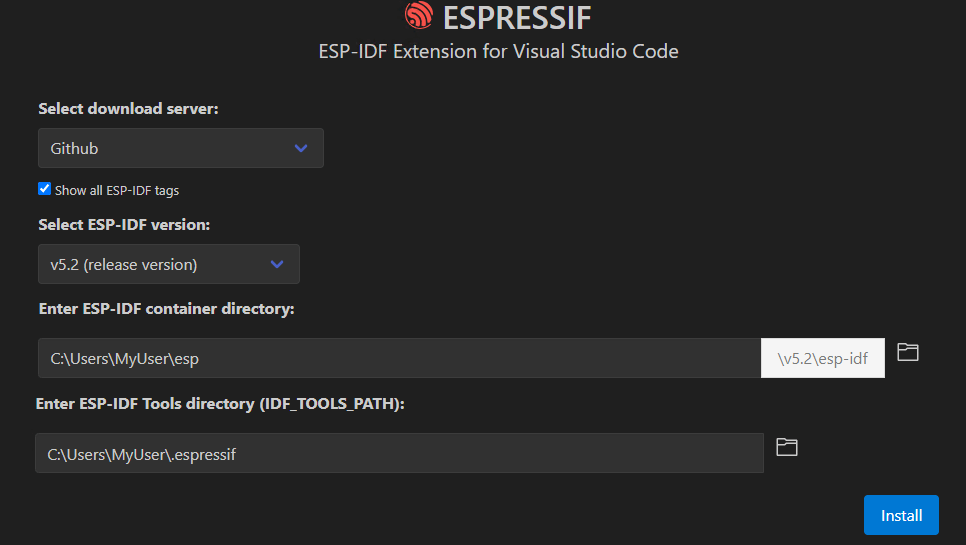

# Setting up the Development Environment

## 1. Install Visual Studio Code  
Download and install VSCode from the official website:  
[https://code.visualstudio.com/download](https://code.visualstudio.com/download)

## 2. Install USB Drivers  
The driver is required for Windows to recognize the ESP32.

1. Download the Silicon Labs `CP210x Windows Drivers`:  
[https://www.silabs.com/developers/usb-to-uart-bridge-vcp-drivers](https://www.silabs.com/developer-tools/usb-to-uart-bridge-vcp-drivers?tab=downloads#:~:text=9/3/2020-,CP210x%20Windows%20Drivers,-v6.7.6)  
2. Extract the downloaded archive `CP210x_Windows_Drivers.zip`  
3. Install the driver by running `CP210xVCPInstaller_x64.exe`

## 3. Install Visual C++ Redistributable  
The Visual C++ Redistributable is required for compiling the project.

1. Download the latest version of the Visual C++ Redistributable Packages from the Microsoft website:  
[https://learn.microsoft.com/en-us/cpp/windows/latest-supported-vc-redist](https://learn.microsoft.com/en-us/cpp/windows/latest-supported-vc-redist?view=msvc-170#latest-microsoft-visual-c-redistributable-version:~:text=supported%20x86%20version-,X64,-https%3A//aka.ms)  
2. Run the downloaded file and follow the instructions to complete the installation.

## 4. Install Slint Extension (optional)
The Slint extension for VSCode adds support for the Slint design markup language and live previews.

1. Open VSCode.  
2. Open the **Extensions** view:  
   - Via the Extensions icon  in the sidebar or  
   - Using the shortcut `Ctrl + Shift + X`.  
3. Enter `slint.slint` in the search field.  
4. Install the first result **Slint** by clicking "Install".

Alternatively, you can install the extension directly from the Visual Studio Marketplace:  
[Slint](https://marketplace.visualstudio.com/items?itemName=slint.slint)

## 5. Install ESP-IDF Extension  
1. Open VSCode.  
2. Open the **Extensions** view
3. Enter `espressif.esp-idf-extension` in the search field.  
4. Install the first result **ESP-IDF** by clicking "Install".

Alternatively, you can install the extension directly from the Visual Studio Marketplace:  
[ESP-IDF](https://marketplace.visualstudio.com/items?itemName=espressif.esp-idf-extension)

## 6. Set up the ESP-IDF Extension  
After installation, the extension needs to be configured.

1. Open the ESP-IDF Explorer: Press `F1` in VSCode, type `ESP-IDF: Configure ESP-IDF Extension`, and select it.  
   

2. Select **Express** Setup Mode.  
   

3. Enable the checkbox **Show all ESP-IDF tags**.  
4. For **Select ESP-IDF version**, choose version **v5.2 (release version)**.  
5. Click "Install" and wait for the installation to complete (approximately 10 minutes).  
   

`Status: Visual Studio Code Version 1.95.3, Slint Extension Version v1.8.0, ESP-IDF Extension Version 1.9.0, Visual C++ Redistributable 14.42.34433.0`
